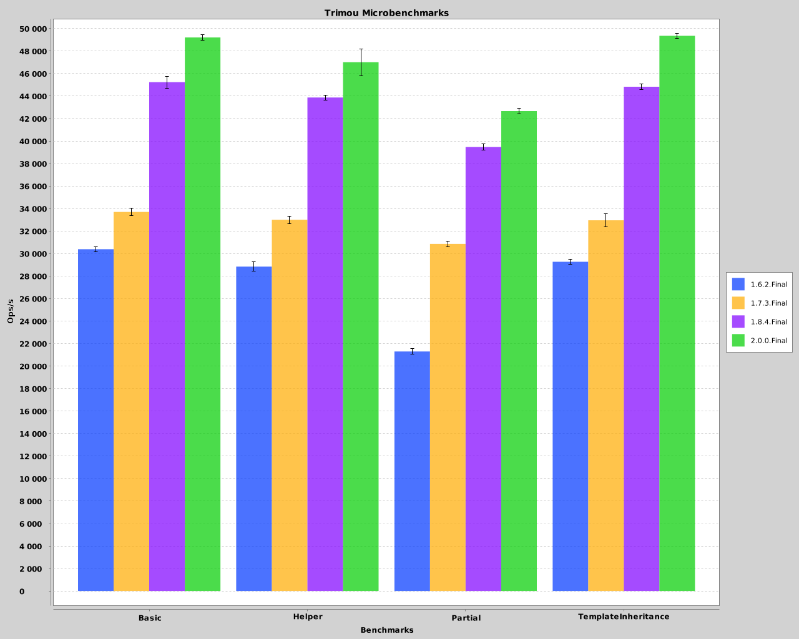

# trimou-benchmarks

Running the benchmarks
======================

> $ ./benchmarks.sh

to run benchmarks and generate a chart for `1.6.2.Final`, `1.7.3.Final` and `1.8.0-SNAPSHOT`, or

> $ mvn package -Dversion.trimou=1.8.0-SNAPSHOT

> $ java -jar target/trimou-benchmarks.jar -rf json -rff results.json

> $ java -cp target/trimou-benchmarks.jar org.trimou.benchmark.chart.ChartGenerator results.json

for a specific Trimou version.

Example Results
===============

